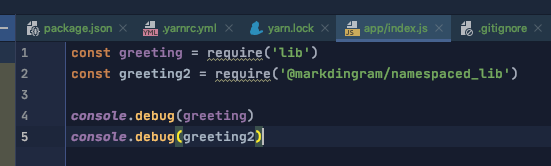

WebStorm 2020.1
Build #WS-201.6668.106, built on April 6, 2020

IntelliSense doesn't appear to work for a namespaced Yarn workspace dependency - 

 

'greeting' from library 'lib' is found.
  
'greeting2' from library '@markingram/namespaced_lib' isn't found. Note the difference in colour.

